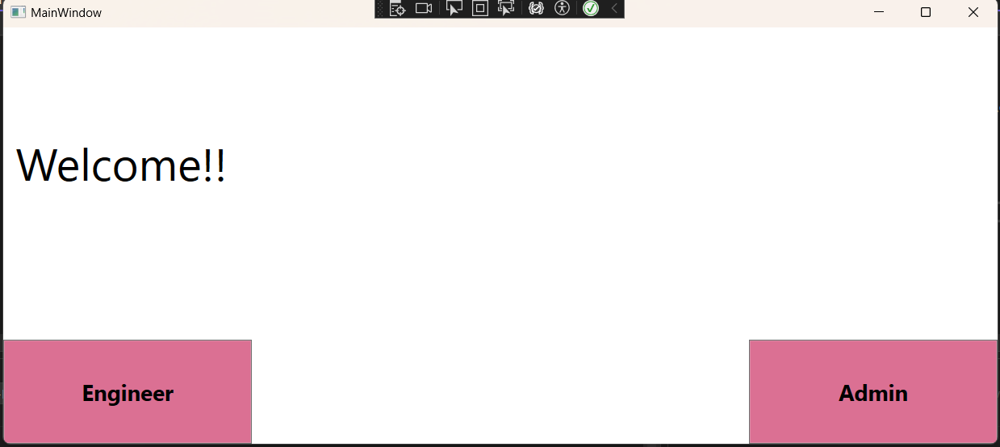

# Project Management System

## Overview
This project is a multi-tier architecture application developed in C# using the .NET Framework. It implements a project management system with a data layer stored in XML and a client-side interface built with WPF (Windows Presentation Foundation).

## Table of Contents
1. [Architecture](#architecture)
2. [Features](#features)
3. [Requirements](#requirements)
4. [Installation](#installation)
5. [Usage](#usage)
6. [Data Layer (DAL)](#data-layer-dal)
7. [Business Logic Layer (BLL)](#business-logic-layer-bll)
8. [Presentation Layer](#presentation-layer)
9. [Data Entities](#data-entities)
10. [Logical Entities](#logical-entities)

## Architecture
The application follows a multi-tier architecture:
- Data Access Layer (DAL): Handles data storage and retrieval using XML
- Business Logic Layer (BLL): Implements the core functionality and business rules
- Presentation Layer: WPF-based user interface

## Features
### Project Manager Capabilities
- Manage tasks:
  - View task list
  - Add new tasks
  - Update task details
  - Assign tasks to engineers
  - Define project timeline and milestones
- Manage milestones:
  - View milestone list
  - Set task dependencies for milestones
  - Update milestone details
  - Get list of engineers associated with a milestone
- Manage engineers:
  - Add and remove engineers
  - View list of company engineers
  - View tasks assigned to an engineer
  - View milestones related to an engineer

### Engineer Capabilities
- View details of current assigned task
- View list of available tasks for selection
- Update progress on assigned task

## Requirements
- .NET Framework (version 7.0 or higher)
- Visual Studio (version 2022 or higher)
- Git

## Installation
1. Clone the repository:
2. Open the solution file in Visual Studio
3. Restore NuGet packages
4. Build the solution

## Usage
To use the Project Management System:

1. Launch the application.
2. Log in as either a Project Manager or an Engineer.

Screenshot: Main interface of the Project Management System

For Project Managers:
- Create a new project by setting start and end dates.
- Add engineers to the project team.
- Create tasks, specifying details such as title, description, and estimated duration.
- Define task dependencies using the interface.
- Run the milestone calculation algorithm to generate project milestones.
- Assign tasks to engineers based on their skills and availability.
- Monitor project progress through the dashboard and milestone views.
- Update task statuses and milestone information as the project progresses.

For Engineers:
- View assigned tasks and their details.
- Update task progress and status.
- Mark tasks as complete when finished.
- View available tasks for selection when current task is completed.

The system will automatically update project timelines and milestone progress based on task completions and dependencies. Regular use of the system by both managers and engineers ensures up-to-date project tracking and facilitates efficient project management.

## Data Layer (DAL)
The Data Access Layer is responsible for:
- Defining data contracts (data entities)
- Implementing service contracts through interfaces for each entity
- Storing data in object lists and XML files
- Providing CRUD operations
- Handling exceptions
- Implementing a generic interface for uniform data access

### Data Source
- The `DataSource` class contains lists of objects:
- At least 20 tasks
- At least 5 engineers
- At least 40 dependencies

### Configuration Data
- Project start date
- Planned project end date
- Next available automatic task ID
- Next available automatic dependency ID

### XML Storage
- Separate XML file for each data entity
- Configuration data stored in `data-config.xml`

### IDal Interface
- Includes CRUD operations for entities
- `Reset()` method to clear all data
- Properties for project start and end dates

## Business Logic Layer (BLL)
The Business Logic Layer implements the core functionality, including:
- Engineer management
- Task management
- Milestone management
- Project timeline creation
- Data validation and business rules enforcement

### Milestone Calculation Algorithm
The BLL implements a crucial algorithm for calculating project milestones:

1. Group dependencies: Create a grouped list from the dependency list, where each group represents a dependent task and its prerequisites.
2. Sort dependencies: Sort the list of prerequisite groups.
3. Filter unique groups: Create a filtered list of unique prerequisite groups to identify distinct milestones.
4. Create milestones: For each unique prerequisite group:
a. Generate a new milestone.
b. Establish dependencies between the new milestone and all tasks in the prerequisite group.
5. Link tasks to milestones: For each dependent task in the original grouped list, create a dependency between the task and its corresponding milestone.
6. Project start milestone: Create a special milestone to mark the project's start.
7. Link independent tasks: Add dependencies between the project start milestone and all tasks that have no prerequisites.

This algorithm ensures that milestones accurately represent groups of related tasks and their dependencies, facilitating effective project management and timeline visualization.

## Presentation Layer
The presentation layer is built using WPF and includes:
- Main window with options for manager and engineer access
- Engineer management interface
- Task management interface
- Milestone management interface
- Project timeline visualization

## Data Entities
1. Task
- Unique identifier (auto-incremented)
- Title
- Description
- Creation date
- Required duration
- Milestone flag (boolean)
- Planned start date
- Actual start date
- Latest possible end date (deadline)
- Actual end date
- Output
- Notes
- Assigned engineer ID
- Task difficulty level

2. Dependency
- Unique identifier (auto-incremented)
- Dependent task ID
- Prerequisite task ID

3. Engineer
- Unique identifier
- Full name
- Email address
- Skill level
- Hourly rate

## Logical Entities
1. Engineer (for engineer list and details screens)
- ID
- Name
- Email
- Skill level
- Hourly rate
- Current task ID and title (if assigned)

2. Task (for task details screen)
- ID
- Title
- Description
- Creation date
- Status
- List of dependencies (TaskInList type)
- Related milestone (ID and title)
- Estimated start date
- Actual start date
- Estimated end date
- Latest end date
- Actual end date
- Output
- Notes
- Assigned engineer (ID and name, if assigned)
- Difficulty level

3. Milestone (for milestone details screen)
- ID
- Title
- Description
- Creation date
- Status
- Start date
- Estimated end date
- Latest end date
- Actual end date
- Progress percentage
- Notes
- List of dependencies (TaskInList type)

### Helper Entities
- TaskInList (for dependency lists and task list screen)
- MilestoneInList (for milestone list screen)